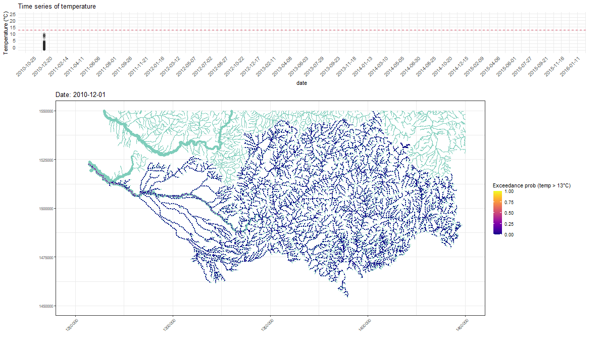

<!-- README.md is generated from README.Rmd. Please edit that file -->

```{r, include = FALSE}
knitr::opts_chunk$set(
  collapse = TRUE,
  comment = "#>",
  fig.path = "man/figures/README-",
  out.width = "100%"
)
```

# SSNbayes

<!-- badges: start -->
<!-- badges: end -->

SSNbayes fits spatio-temporal stream network data using Bayesian inference.

## Installation

You can install the released version of SSNbayes from [CRAN](https://CRAN.R-project.org) with:

``` r
install.packages("SSNbayes")
```

And the development version from [GitHub](https://github.com/) with:

``` r
devtools::install_github("EdgarSantos-Fernandez/SSNbayes")
```

See more details in the article:

``Bayesian spatio-temporal models for stream networks'' (https://www.sciencedirect.com/science/article/pii/S0167947322000263)


# Reproducible examples
These examples show the package in action:

*    kaggle.com/edsans/ssnbayes

*    kaggle.com/edsans/ssnbayes-simulated


# Example of one of the outputs produced




