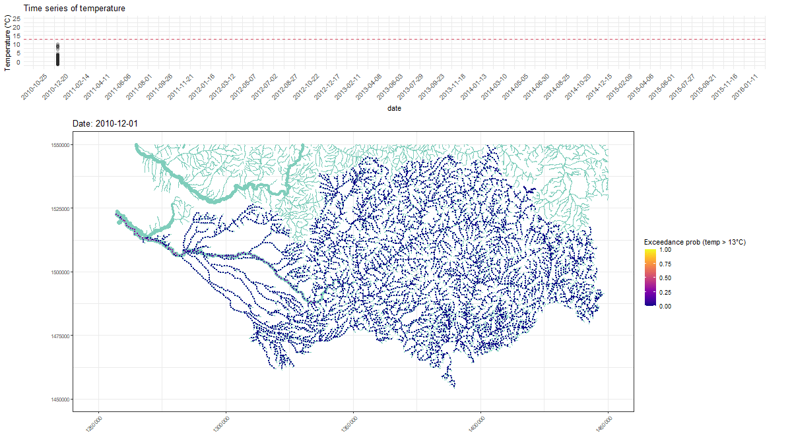

<!-- README.md is generated from README.Rmd. Please edit that file -->

# SSNbayes

<!-- badges: start -->
<!-- badges: end -->

SSNbayes fits spatio-temporal stream network data using Bayesian
inference in Stan.

## Installation

You can install the released version of SSNbayes from
[CRAN](https://CRAN.R-project.org) with:

``` r
install.packages("SSNbayes")
```

And the development version from [GitHub](https://github.com/) with:

``` r
devtools::install_github("EdgarSantos-Fernandez/SSNbayes")
```

See more details in the articles Santos-Fernandez, Hoef, et al. (2022)
and Santos-Fernandez, Ver Hoef, et al. (2022)

# Reproducible examples

These examples show the package in action:

- kaggle.com/edsans/ssnbayes

- kaggle.com/edsans/ssnbayes-simulated

# Example of one of the outputs produced

Evolution of the Boise River exceedance probability:



# References

<div id="refs" class="references csl-bib-body hanging-indent">

<div id="ref-ssnbayesArxiv" class="csl-entry">

Santos-Fernandez, Edgar, Jay M. Ver Hoef, James M. McGree, Daniel J.
Isaak, Kerrie Mengersen, and Erin E. Peterson. 2022. “SSNbayes: An r
Package for Bayesian Spatio-Temporal Modelling on Stream Networks.”
arXiv. <https://doi.org/10.48550/ARXIV.2202.07166>.

</div>

<div id="ref-SANTOSFERNANDEZ2022107446" class="csl-entry">

Santos-Fernandez, Edgar, Jay M. Ver Hoef, Erin E. Peterson, James
McGree, Daniel J. Isaak, and Kerrie Mengersen. 2022. “Bayesian
Spatio-Temporal Models for Stream Networks.” *Computational Statistics &
Data Analysis* 170: 107446.
https://doi.org/<https://doi.org/10.1016/j.csda.2022.107446>.

</div>

</div>
